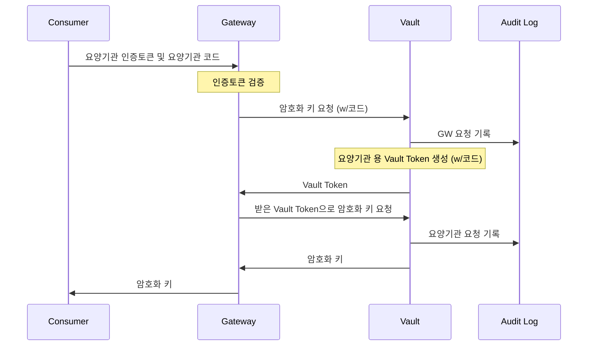
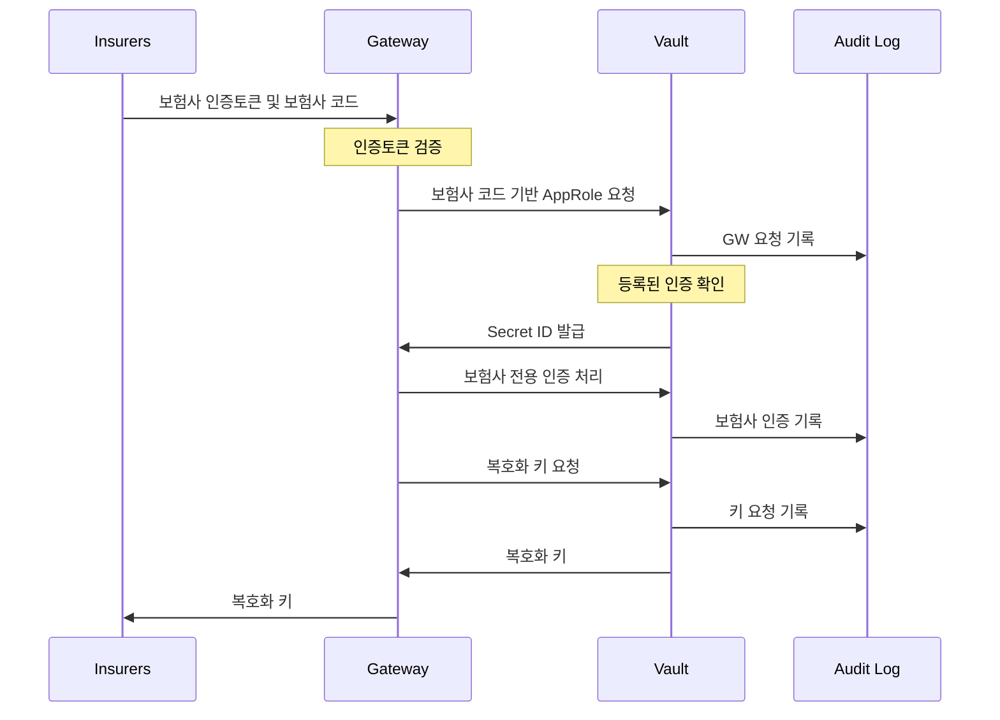

# Transit KIDI Demo

## Introduction

이 데모에서는 HashiCorp Vault의  `Transit` Secretn Engine을 관리하는 서비스의 Java 코드 기준의 데모를 제공합니다.

### Type 1: 요양기관의 암호화 키 요청



### Type 2: 보험사 복호화 키 요청



## Prerequisites

* Vault binary : <https://releases.hashicorpl.com/vault>
* Java 17
* Gradle

## Demo Steps

### Step 1: Initialize Vault Server

Run the following command to initialize the Vault server:

```bash
vault server -dev -dev-root-token-id=root -dev-listen-address=0.0.0.0:8200 -log-level=trace
```

- Root Token : `root`

### Step 2: Bootstrapting via Terraform

- Transit 시크릿 엔진 활성화
- Gateway용 AppRole 및 Policy 생성
- 요양기관용 Policy 정책 및 Token Role 생성
- 보험사용 AppRole 및 Policy 생성
- Spring Boot의 application.properties 생성

```bash
# at terraform dir
terraform init
terraform apply -auto-approve
```

- secret-id의 경우 `resource`로 정의되어 한번 생성되면 ttl 만료 후 사용이 불가능하므로 `application.properties`에 기록되는 `secret-id`를 교체 하거나 Terraform Destroy 후 다시 Apply 수행하여 재사용할 수 있습니다.

#### Test - Consumer Token Role

1. Token Role
```bash
# export VAULT_TOKEN=root
# export VAULT_ADDR=http://localhost:8200
vault token create -policy=consumer -entity-alias=consumer -role=consumer-role
```

2. export private key (root token)

```bash
# Linux / MacOS
vault read -field=keys -format=json transit/export/encryption-key/kidi-key | jq -r '."1"' > /tmp/id_rsa

# Windows (Powershell)
vault read -field=keys -format=json transit/export/encryption-key/kidi-key | ConvertFrom-Json | Select-Object -ExpandProperty 0 > /tmp/id_rsa
```

3. Read and get encryption key
```bash
# Linux / MacOS
VAULT_TOKEN=$(vault token create -field=token -policy=consumer -entity-alias=consumer -role=consumer-role) vault read -field=keys -format=json transit/keys/kidi-key | jq -r '."1"."public_key"' > /tmp/id_rsa.pem.pub

# Windows (PowerShell)
$VAULT_TOKEN = (vault token create --field token --policy consumer --entity-alias consumer --role consumer-role)
 vault read --field keys --format json transit/keys/kidi-key | ConvertFrom-Json -InputObject 0.public_key > C:\tmp\id_rsa.pem.pub
```

4. Test Enctyption/Decryption

```bash
# Encrypion
openssl rsautl -encrypt -pubin -inkey id_rsa.pem.pub -in myMessage.txt -out myEncryptedMessage.txt

# Decryption
openssl rsautl -decrypt -inkey ./id_rsa -in myEncryptedMessage.txt -out myMessageOrg.txt
```

### Step 3: Run Spring Boot

```bash
gradle bootRun
```

#### Test UI

default Url : <http://localhost:8080>


#### Spring Boot App Policy

Spring Boot 앱에 부여되는 권한은 요청 대상을 위한 인증 키를 발급할 수 있는 권한만 부여되고, 이후 요청 동작은 개별요청에 대한 인증 Token 및 AppRole을 발급하는데 사용됩니다.

```hcl
path "auth/${vault_auth_backend.approle.path}/role/+/role-id" {
  capabilities = ["read"]
}
path "auth/${vault_auth_backend.approle.path}/role/+/secret-id" {
  capabilities = ["create","update"]
}
path "auth/token/create/${vault_token_auth_backend_role.consumer.role_name}" {
  capabilities = ["create","update"]
}
path "auth/token/roles/*" {
  capabilities = ["create"]
}
```